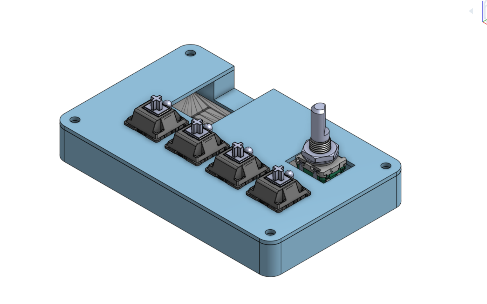
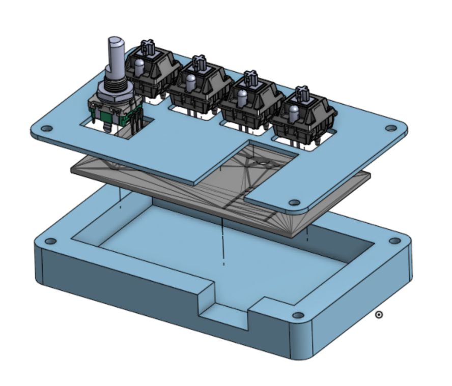
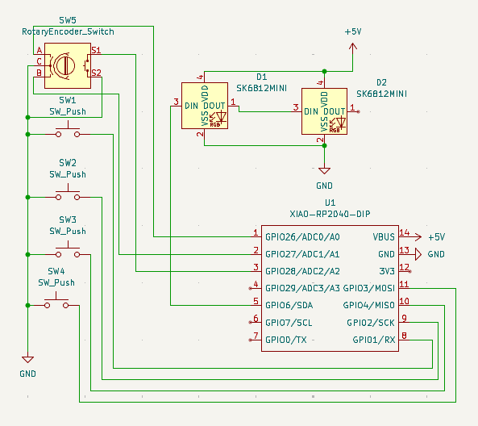
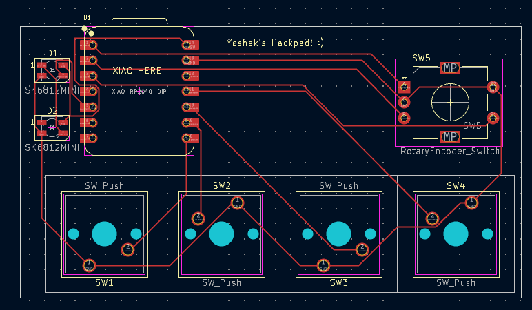

# y-pad
y-pad is a 4 key macropad with a rotary encoder and 2 LEDs.
It's been designed via Onshape, KiCAD, and kmk via Mu

## Features
- 4x MX-style mechanical switches
- 1x EC11 rotary encoder with push-click
- 2x SK6812 MINI RGB LEDs
- Seeed XIAO RP2040 microcontroller
- 3D printed two-piece case with heatset inserts
- Fully open source firmware via KMK

## Overall Design

## CAD

The case is a two-piece 3D printed design — a top plate with cutouts for the switches, encoder, and USB passthrough, and a hollow bottom shell. The PCB sits between them, secured with M3 heatset inserts and screws.

## Schematic

## PCB

## BOM

| Part | Quantity |
|------|----------|
| Seeed XIAO RP2040 | 1 |
| MX-style mechanical switches | 4 |
| EC11 rotary encoder | 1 |
| SK6812 MINI LEDs | 2 |
| M3x16mm screws | 4 |
| M3x5mmx4mm heatset inserts | 4 |
| Custom PCB | 1 |
| 3D printed top plate | 1 |
| 3D printed bottom shell | 1 |
